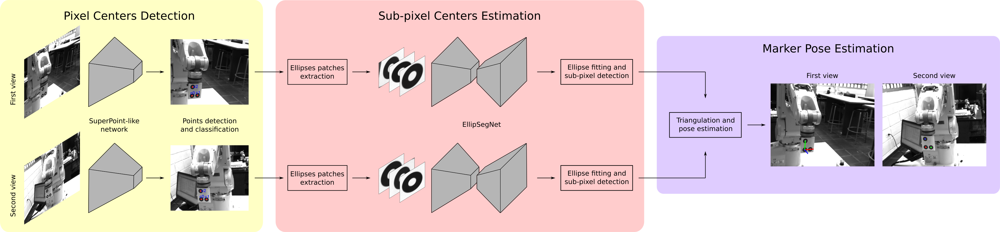

# MarkerPose: Robust real-time planar target tracking for accurate stereo pose estimation

This is a PyTorch and LibTorch implementation of [MarkerPose](https://arxiv.org/abs/2105.00368): a robust, real-time pose estimation method based on a planar marker of three circles and a calibrated stereo vision system for high-accuracy pose estimation.

<p align="center">
    
</p>

MarkerPose method consists of three stages. In the first stage, marker points in a pixel-level accuracy, and their IDs are estimated with a SuperPoint-like network for both views. In the second stage, three square patches that contain each ellipse of the target are extracted centered in the rough 2D locations previously estimated. With EllipSegNet the contour of the ellipses is segmented for sub-pixel-level centroid estimation for the first and second view. Finally, in the last stage, with the sub-pixel matches of both views, triangulation is applied for 3D pose estimation. For more details see our [paper](https://arxiv.org/abs/2105.00368).


<p align="center">
    
</p>


## Pose estimation example

To run the Python or C++ pose estimation examples, you need first to clone this repository and download the dataset. This dataset contains the stereo calibration parameters, stereo images, and pretrained weights for SuperPoint and EllipSegNet.

* Clone this repo: `git clone https://github.com/jhacsonmeza/MarkerPose`
* Download the dataset [here](https://drive.google.com/drive/folders/1wu-o8yGKPjCEZiH-zCL8oGSmm-yNOujJ?usp=sharing).
* Move the `dataset/` folder to the cloned repo folder: `mv path/to/dataset/ MarkerPose/`.

The folder structure into `MarkerPose/` directory should be:

```
MarkerPose
    ├── C++
    ├── dataset
    ├── figures
    └── Python
```

To know how to run the pose estimation examples, see the [`Python/`](https://github.com/jhacsonmeza/MarkerPose/tree/main/Python) folder for the PyTorch version, and the [`C++/`](https://github.com/jhacsonmeza/MarkerPose/tree/main/C++) folder the LibTorch version. Furthermore, the code for training SuperPoint and EllipSegNet is also available in both versions.


## Citation

If you find this code useful, please consider citing:

```
@inproceedings{meza2021markerpose,
  title={MarkerPose: Robust Real-time Planar Target Tracking for Accurate Stereo Pose Estimation},
  author={Meza, Jhacson and Romero, Lenny A and Marrugo, Andres G},
  booktitle={Proceedings of the IEEE/CVF Conference on Computer Vision and Pattern Recognition Workshops},
  year={2020}
}
```
