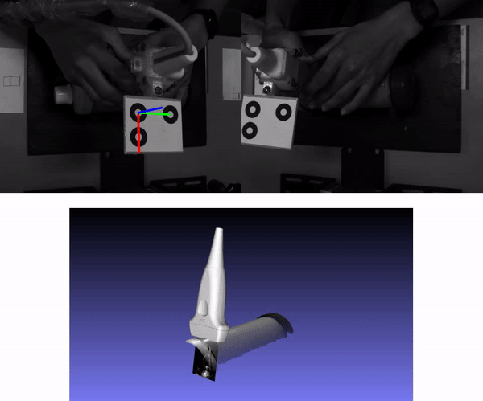

# MarkerPose: Robust Real-time Planar Target Tracking for Accurate Stereo Pose Estimation

This is a PyTorch and LibTorch implementation of [MarkerPose](https://arxiv.org/abs/2105.00368): a robust, real-time pose estimation method based on a planar marker of three circles and a calibrated stereo vision system for high-accuracy pose estimation.

<p align="center">
    
</p>

MarkerPose method consists of three stages. In the first stage, marker points in a pixel-level accuracy, and their IDs are estimated with a SuperPoint-like network for both views. In the second stage, three square patches that contain each ellipse of the target are extracted centered in the rough 2D locations previously estimated. With EllipSegNet the contour of the ellipses is segmented for sub-pixel-level centroid estimation for the first and second view. Finally, in the last stage, with the sub-pixel matches of both views, triangulation is applied for 3D pose estimation. For more details see our [paper](https://arxiv.org/abs/2105.00368).


<p align="center">
    
</p>


## Pose estimation example

To run the Python or C++ pose estimation examples using images of the marker attached to a robotic arm, you need first to clone this repository and download the dataset. This dataset contains the stereo calibration parameters, stereo images, and pretrained weights for SuperPoint and EllipSegNet.

* Clone this repo: `git clone https://github.com/jhacsonmeza/MarkerPose`
* Download the dataset [here](https://drive.google.com/drive/folders/1wu-o8yGKPjCEZiH-zCL8oGSmm-yNOujJ?usp=sharing).
* Move the `dataset/` folder to the cloned repo folder: `mv path/to/dataset/ MarkerPose/`.

The folder structure into `MarkerPose/` directory should be:

```
MarkerPose
    ├── C++
    ├── dataset
    ├── figures
    └── Python
```

To know how to run the pose estimation examples, see the [`Python/`](https://github.com/jhacsonmeza/MarkerPose/tree/main/Python) folder for the PyTorch version, and the [`C++/`](https://github.com/jhacsonmeza/MarkerPose/tree/main/C++) folder the LibTorch version. Furthermore, the code for training SuperPoint and EllipSegNet is also available in both versions.


## MarkerPose for 3D freehand ultrasound
Freehand 3D ultrasound is a medical imaging technique that consists of tracking the pose of an ultrasound probe for mapping any ultrasound scan to 3D space. We reconstructed a cylindrical object which was submerged in water into another cylinder. The diameter of this inner cylinder was measured with the estimated point cloud. For more details about this experiment see our paper (Section 5.3). The following animation shows the stereo vision images with the estimated pose with MarkerPose for the acquired sequence. Furthermore, we have the ultrasound images mapped to 3D space with a 3D model of a probe.


<p align="center">
    
</p>

The 3D representation was generated with [OpenCV 3D Visualizer](https://docs.opencv.org/master/d1/d19/group__viz.html). The 3D model of the external cylindrical object where the probe was moved along, was generated with the structured light technique. For more details see [our repo](https://github.com/jhacsonmeza/StructuredLight_3DfreehandUS), where we propose to combine freehand ultrasound and structured light as a multimodal technique using MarkerPose for pose estimation.


## Citation

If you find this code useful, please consider citing:

```
@inproceedings{meza2021markerpose,
    author    = {Meza, Jhacson and Romero, Lenny A. and Marrugo, Andres G.},
    title     = {MarkerPose: Robust Real-Time Planar Target Tracking for Accurate Stereo Pose Estimation},
    booktitle = {Proceedings of the IEEE/CVF Conference on Computer Vision and Pattern Recognition (CVPR) Workshops},
    month     = {June},
    year      = {2021},
    pages     = {1282-1290}
}
```
